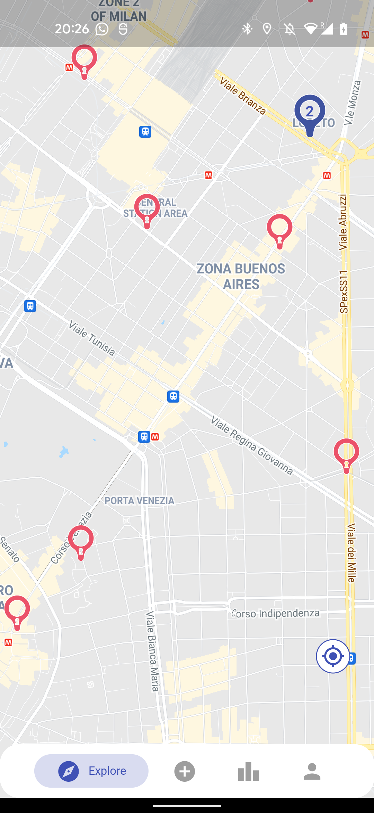
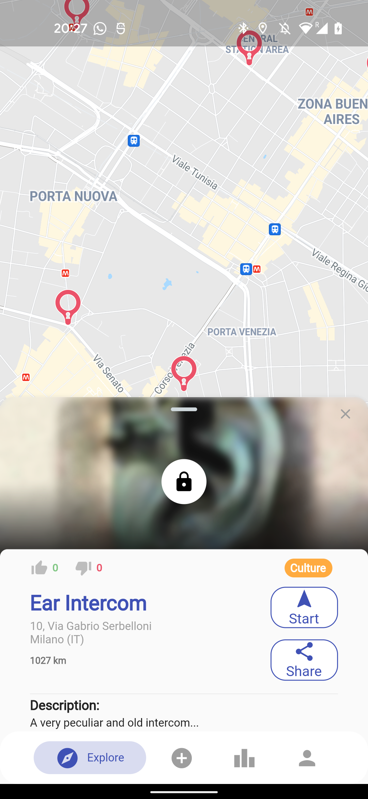
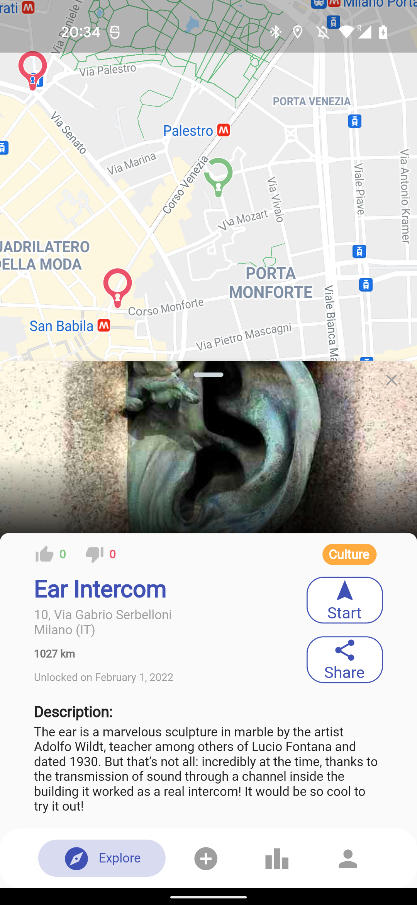
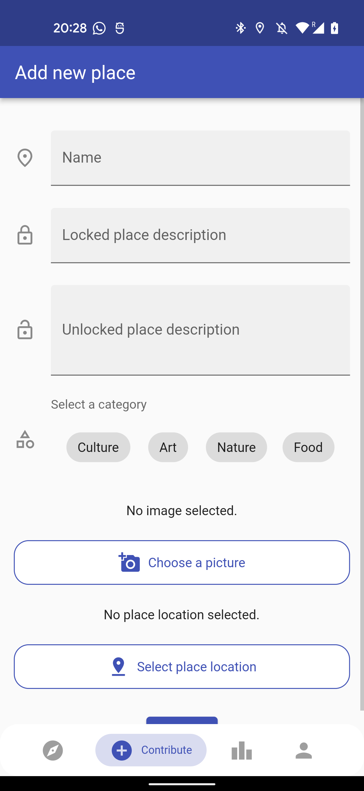
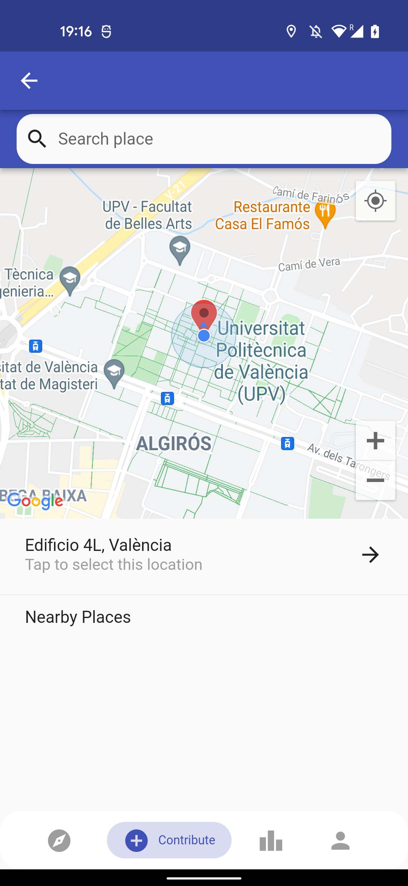
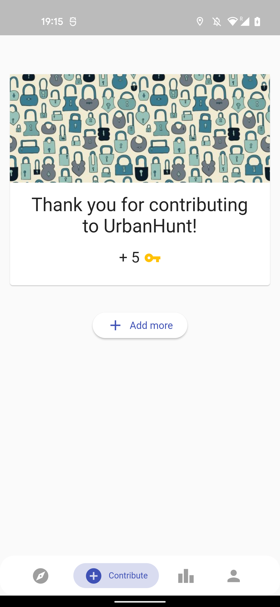
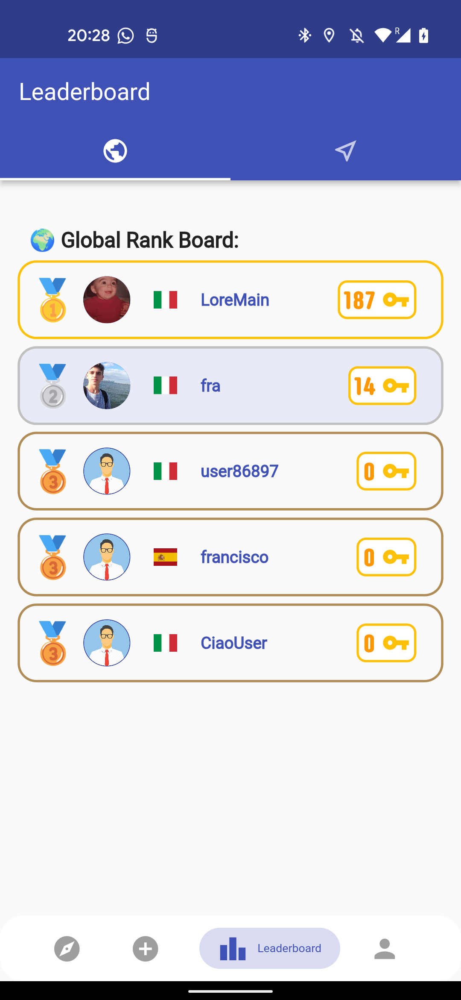
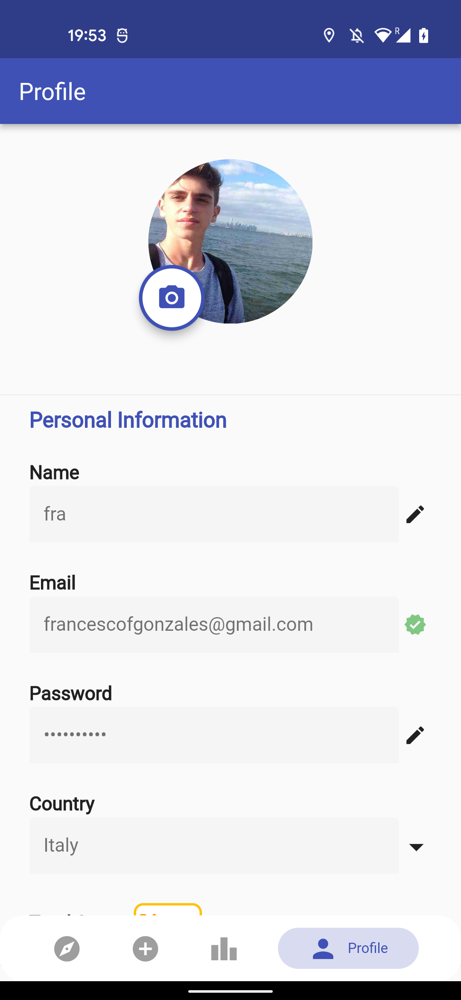
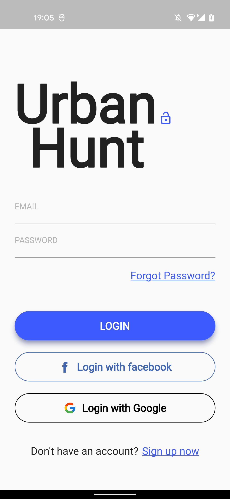
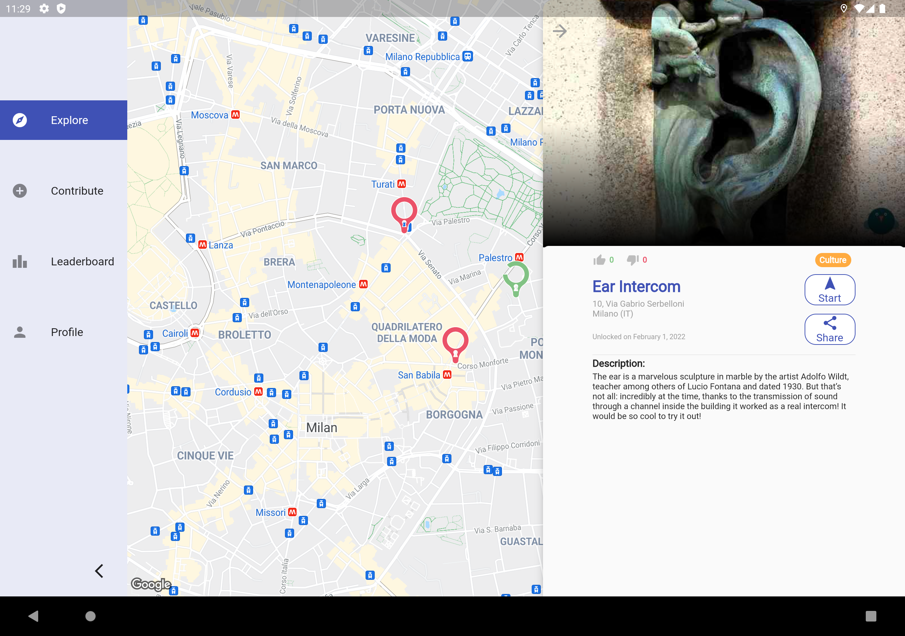

# UrbanHunt

:notebook: **Design Document:** &nbsp;[Download here](https://github.com/fulcus/urbanhunt/raw/master/docs/UrbanHunt%20Design%20Document.pdf)

:file_folder: **Presentation:** &nbsp;[Download here](https://github.com/fulcus/urbanhunt/raw/master/docs/UrbanHunt%20Presentation.pptx)

## Goal of the project :dart:

This repository contains the work done for the course of ***Design and Implementation of Mobile Applications*** at Politecnico di Milano.

UrbanHunt is a mobile application that lets users discover unusual and interesting places in their city, or a city they are visiting. When they are physically in one of the recommended places they can unlock it and get points to compete with other users. The places are crowdsourced, in fact users can add new places to the map.

## Technologies used :nut_and_bolt:

- **Frontend**
  - Flutter, for mobile and tablet
- **Backend**
  - Firebase [Authentication, Functions, Firestore (Database), Storage]

*The usage of these technologies is further detailed in the design document.*

## APIs
  - Google Maps
  - Firebase
  - ip-api

## Screenshots

  
   
  
  
   
  
  
  
  
   

## Authors
[Francesco Gonzales](https://github.com/fulcus), [Lorenzo Mainetti](https://github.com/lorenzomainetti)
